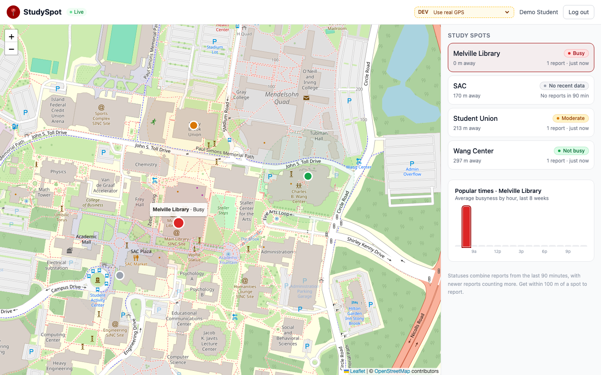
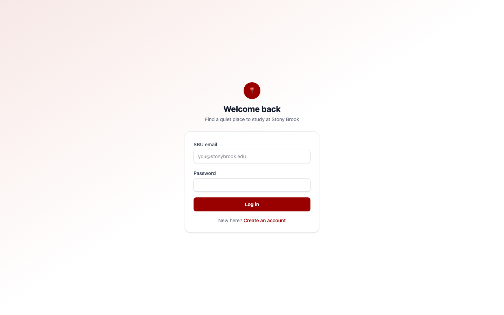
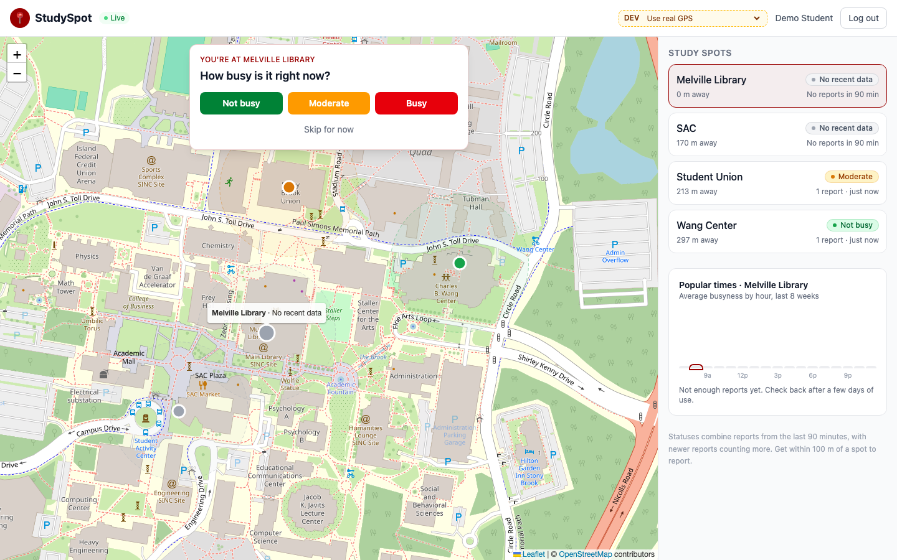
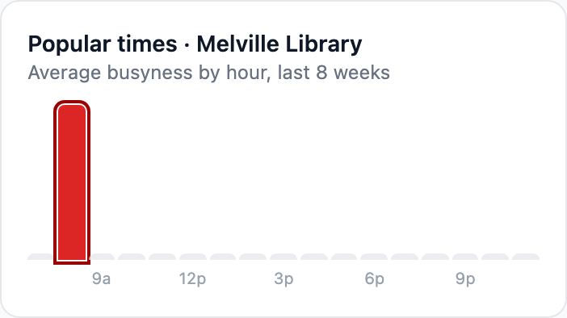

# StudySpot

I built this because I kept walking across Stony Brook to the library or the Union only to find every seat taken. StudySpot lets students near a study spot say how busy it is, so everyone else can check before they go. It's a rebuild of my older Streamlit version, [SBU-Study-Spot-](https://github.com/BhishmaGaudani/SBU-Study-Spot-).

## Screenshots



| Login | Report prompt | Popular times |
| --- | --- | --- |
|  |  |  |

## What it does

- When you're within 100 m of a spot (Melville Library, Student Union, Wang Center, SAC), it asks "How busy is it?" and you can answer or skip.
- The server checks your distance and only lets you report each spot once every 30 minutes.
- Each spot's status is a weighted average of reports from the last 90 minutes, where newer reports count more. With no recent reports it shows "No recent data".
- New reports show up on everyone's screen right away over WebSockets.
- Each spot has a popular times chart built from past reports.
- Only @stonybrook.edu emails can sign up.

## Tech

React, TypeScript, Vite, Tailwind, Leaflet / FastAPI, SQLModel, Alembic / Supabase (Postgres) / JWT + bcrypt / pytest

## Running it locally

You need Python 3.11+, Node 20+ and a free Supabase project. In Supabase, click Connect and copy the Session pooler connection string.

Backend:

```bash
cd server
python3 -m venv .venv && source .venv/bin/activate
pip install -r requirements.txt
cp .env.example .env   # add your DATABASE_URL and a JWT_SECRET
alembic upgrade head
python -m app.seed
uvicorn app.main:app --reload
```

Frontend (in another terminal):

```bash
cd client
npm install
npm run dev
```

Then open http://localhost:5173. In dev mode there's a "Pretend I'm at..." dropdown so you can test without being on campus. See `server/.env.example` for all the settings.

Tests:

```bash
cd server && pytest
```

## What I'd improve next

- Email verification, since right now anyone can sign up with an @stonybrook.edu address they don't own.
- Background "you're near the library" notifications, which would need a native app (probably React Native).
- More spots, and status per floor (library 1st floor vs 3rd floor).
- Redis or Postgres LISTEN/NOTIFY so live updates work across more than one server.
- Better spam protection. The server has to trust the GPS coordinates the browser sends, so someone could fake their location.
